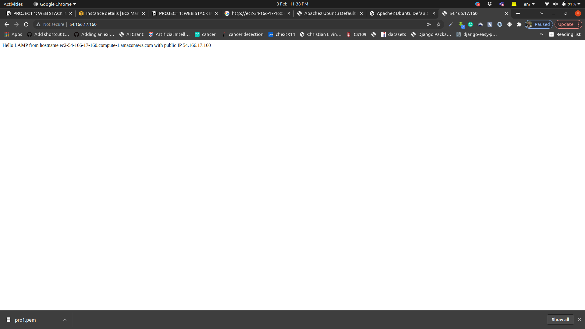
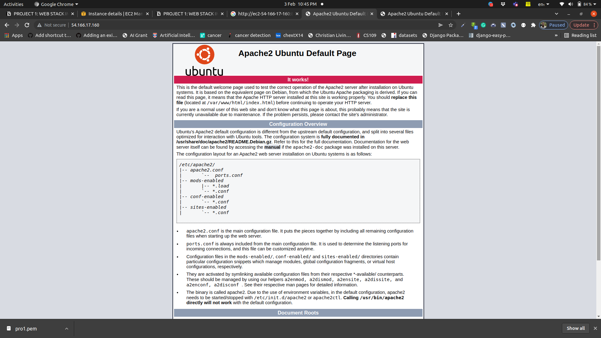
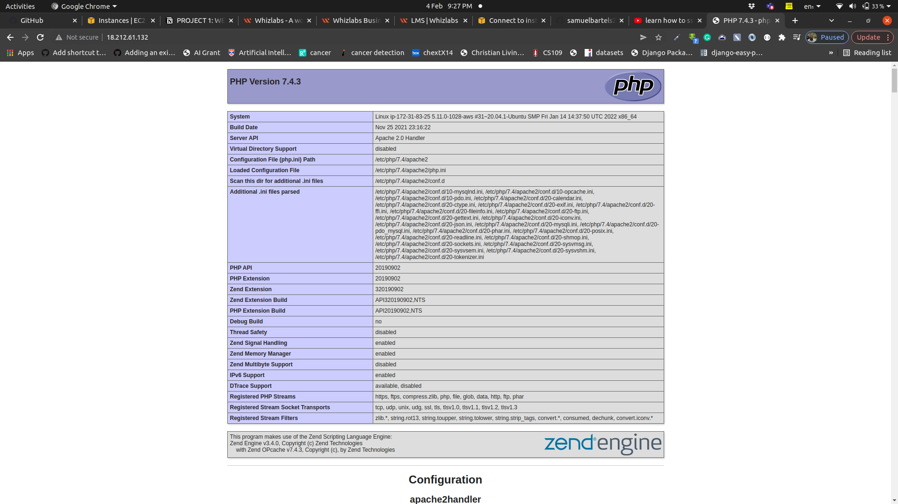

# LAMP-PROJECT
WEB STACK IMPLEMENTATION IN AWS

Before getting into this Lamp project, i would like to address What a STack (technology) is. A Technology Stack is is a set of frameworks and tools used to develop a software product. This set of frameworks and tools are very specifically chosen to work together in creating a well-functioning software. They are acronymns for individual technologies used together for a specific technology product. some examples are…

- **LAMP** (Linux, Apache, MySQL, PHP or Python, or Perl)
- **LEMP** (Linux, Nginx, MySQL, PHP or Python, or Perl)
- **MERN** (MongoDB, ExpressJS, ReactJS, NodeJS)
- **MEAN** (MongoDB, ExpressJS, AngularJS, NodeJS

So for this ,I am going to tackle LAMP. But before we begin, soe Basics

PREREQUISTITES.

To complete this LAMP project, one must need an AWS account and a virtual server with Ubuntu Server OS.
pinning up a new EC2 instance (an instance of a virtual server) is only a matter of a few clicks.

You can follow the instructions below  to get yourself set up:

1. Register a new AWS account (if you don't have) via the AWS management console
2. Select your preferred region (the closest to you) and launch a new EC2 instance of t2.micro family with Ubuntu Server 20.04 LTS (HVM).

After the setup, save your private key (.pem file) securely and do not share it with anyone! If you lose it, you will not be able to connect to your server ever again!. 
 
 NB: My assumptions are that you are a Mac user (because  you wound simply open up Terminal and use the ssh command to get into the server.) But if you are a Windows User, you would need a tool called Putty to connect to your EC2 instance.

 CONNECTING TOEC2 USING THE TERMINAL 
 To connect to EC2 to the terminal (as a Mac user), 
 - The terminal is already installed by default. You just need to open it up.
- You do not need to convert to a `.ppk` file. Just use the same key as downloaded from AWS.
- Change directory into the loacation where your `PEM` file is. Most likely will be in the **Downloads** folder. Thus cd into Downloads using cd ~/Downloads

with the private key.pem copied form your running EC2 instance,
- Change premissions for the private key file (.pem), otherwise you can get an error “Bad permissions”

`sudo chmod 0400 <private-key-name>.pem`

- Connect to the instance by running

`ssh -i <private-key-name>.pem ubuntu@<Public-IP-address>`

With this you have created a Linux Server In the cloud.

NB: To prevent loss, you would have to stop the EC2 instance  when not using it.

INSTALLING APACHE AND UPDATING THE FIREWALL
But before we install Apache, What is it? 
Apache HTTP Server is the most widely used web server software. It is an open source software available for free. It runs on 67% of all webservers in the world. It is fast, reliable, and secure. It can be highly customized to meet the needs of many different environments by using extensions and modules. Most WordPress hosting providers use Apache as their web server software. 
The Apache web server is among the most popular web servers in the world. It’s well documented, has an active community of users, and has been in wide use for much of the history of the web, which makes it a great default choice for hosting a website.

To install Apache using Ubuntuu's package manager 'apt';
`#update a list of packages in package manager
$ sudo apt update 
#run apache2 package installation
$ sudo apt install apache2`
 

Afterwards, we  verify that apache2 is running as a Service in our OS, by use following command

`$ sudo systemctl status apache2`
if it is green and running then you have just launched your first Web Server in the Clouds!

But to receive any traffic by our Web Server, we need to open TCP port 80 which is the default port that web browsers use to access web pages on the Internet.

Already, we have TCP port 22 open by default on our EC2 machine to access it via SSH, so we need to add a rule to EC2 configuration to open inbound connection through port 80.

Here, the erver is running and we can access it locally and from the Internet (Source 0.0.0.0/0 means ‘from any IP address’).

We can try to access it locally in our Ubuntu shell by running any of these commands;
$ curl http://localhost:80
or
$ curl http://127.0.0.1:80
They are vitually the same but the difference is that: in the first case we try to access our server via DNS name and in the second one - by IP address (in this case IP address 127.0.0.1 corresponds to DNS name ‘localhost’ and the process of converting a DNS name to IP address is called “resolution”). We will touch DNS in further lectures and projects.

Now, we can access or test our Apache HTTP server to see if it responds to the internet. To do so, open a web browser of your choice and try to access following url
http://<Public-IP-Address>:80

 You will see this page signalling that your s now correctly installed and accessible through your firewall.

INSTALLING MySQL

Since we have a web server runing, you need to install a Database Management System (DBMS) to be able to store and manage data for your site in a relational database.
But what is  MySQL?
it is a popular relational database management system used within PHP environments, so we will use it in our project.

Moving forward, we will use ‘apt’ to acquire and install this software:

`$ sudo apt install mysql-server`
if prompted to confirm installation, type y and then press ENTER. When the installation is finished, it’s recommended that you run a security script that comes pre-installed with MySQL. 
Start the interactive script by running:

`$ sudo mysql_secure_installation`

This will ask if you want to configure the `VALIDATE PASSWORD PLUGIN`. Answer yes by pressing y and set a password. The level of one;s password is dependant on him/herself but it must be a strong password.
When done, test to see if you are able to log in o the MySQL console by typing:

`$ sudo mysql`

This will connect to the MySQL server as the administrative database user **root**, which is inferred by the use of sudo when running this command. You should see output like this:

`Welcome to the MySQL monitor.  Commands end **with** ; **or** \g.
Your MySQL connection id **is** 11
Server version: 8.0.22-0ubuntu0.20.04.3 (Ubuntu)

Copyright (c) 2000, 2020, Oracle **and**/**or** its affiliates. All rights reserved.

Oracle **is** a registered trademark of Oracle Corporation **and**/**or** its
affiliates. Other names may be trademarks of their respective
owners.

Type 'help;' **or** '\h' **for** help. Type '\c' to clear the current input statement.

mysql>`

To exit the MySQL console, type:

`mysql> exit`

INSTALLING PHP
Before we install PHP, i would like to explain why we need to install PHP.  PHP is the component of our setup that will process code to display dynamic content to the end user. In addition to the php package, you’ll need php-mysql, a PHP module that allows PHP to communicate with MySQL-based databases. You’ll also need libapache2-mod-php to enable Apache to handle PHP files.

To install these packages at once, we run;

$ sudo apt install php libapache2-mod-php php-mysql

Once it is done,you can run the following command to confirm your PHP version:

`php -v`

`PHP 7.4.3 (cli) (built: Oct  6 2020 15:47:56) ( NTS )
Copyright (c) The PHP Group
Zend Engine v3.4.0, Copyright (c) Zend Technologies`

At this point our LAMP stack is fully insatlled and fully operational.

CREATING A VIRTUAL HOST FOR OUR WEBSITE USING APACHE.
So we have a domain name called projectlamp.
Apache on Ubuntu 20.04 has one server block enabled by default that is configured to serve documents from the **/var/www/html** directory. We will leave this configuration as is and will add our own directory next next to the default one.

So we create the directory for `projectlamp` using ***‘mkdir’*** command as follows:

`$ sudo mkdir /var/www/projectlamp`

Next, we assign ownership of the directory with the `$USER` environment variable, which will reference your current system user:

`$ sudo chown -R $USER:$USER /var/www/projectlamp`

Then, we create and open a new configuration file in Apache’s `sites-available` directory using your preferred command-line editor. Here, we’ll be using `vi` or `vim` (They are the same by the way):

`$ sudo vi /etc/apache2/sites-available/projectlamp.conf`

This will create a new blank file.  in the blank page,paste in the following bare-bones configuration by hitting on `i` on the keyboard to enter the insert mode, and paste the text:

`<VirtualHost *:80>
    ServerName projectlamp
    ServerAlias www.projectlamp 
    ServerAdmin webmaster@localhost
    DocumentRoot /var/www/projectlamp
    ErrorLog ${APACHE_LOG_DIR}/error.log
    CustomLog ${APACHE_LOG_DIR}/access.log combined
</VirtualHost>`
We save and close the file.

To see the new file in the sites-available directory, we run;
$ sudo ls /etc/apache2/sites-available
You will see something like this
000-default.conf  default-ssl.conf  projectlamp.conf

With this irtualHost configuration, we’re telling Apache to serve projectlamp using /var/www/projectlampl as its web root directory.

You can now use ***a2ensite*** command to enable the new virtual host:

`$ sudo a2ensite projectlamp`

You might want to disable the default website that comes installed with Apache. This is required if you’re not using a custom domain name, because in this case Apache’s default configuration would overwrite your virtual host. To disable Apache’s default website use ***a2dissite*** command , type:

`$ sudo a2dissite 000-default`

To make sure your configuration file doesn’t contain syntax errors, run:

`$ sudo apache2ctl configtest`

Finally, reload Apache so these changes take effect:

`$ sudo systemctl reload apache2`

Your new website is now active, but the web root **/var/www/projectlamp** is still empty. Create an index.html file in that location so that we can test that the virtual host works as expected:

`sudo echo 'Hello LAMP from hostname' $(curl -s http://169.254.169.254/latest/meta-data/public-hostname) 'with public IP' $(curl -s http://169.254.169.254/latest/meta-data/public-ipv4) > /var/www/projectlamp/index.html`

Now go to your browser and try to open your website URL using IP address:

`http://<Public-IP-Address>:80`

If you see the text from ***‘echo’*** command you wrote to index.html file, then it means your Apache virtual host is working as expected. In the output you will see your server’s public hostname (DNS name) and public IP address. You can also access your website in your browser by public DNS name, not only by IP - try it out, the result must be the same (port is optional)

`http://<Public-DNS-Name>:80`
The file can be left as a temporary landing page for our application until  we set up an index.php file to replace it.

ENABLING PHP ON THE WEBSITE

he default **DirectoryIndex** settings on Apache, a file named `index.html` will always take precedence over an `index.php` file. This is useful for setting up maintenance pages in PHP applications, by creating a temporary `index.html` file containing an informative message to visitors. Because this page will take precedence over the `index.php` page, it will then become the landing page for the application. Once maintenance is over, the `index.html` is renamed or removed from the document root, bringing back the regular application page.

In case you want to change this behavior, you’ll need to edit the **/etc/apache2/mods-enabled/dir.conf** file and change the order in which the **index.php** file is listed within the **DirectoryIndex** directive:

`sudo vim /etc/apache2/mods-enabled/dir.conf`

`<IfModule mod_dir.c>
        *#Change this:#DirectoryIndex index.html index.cgi index.pl index.php index.xhtml index.htm#To this:*DirectoryIndex index.php index.html index.cgi index.pl index.xhtml index.htm
</IfModule>`

After saving and closing the file, you will need to reload Apache so the changes take effect:

`$ sudo systemctl reload apache2`

Finally, we will create a PHP script to test that PHP is correctly installed and configured on your server.

Now that you have a custom location to host your website’s files and folders, we’ll create a PHP test script to confirm that Apache is able to handle and process requests for PHP files.

Create a new file named `index.php` inside your custom web root folder:

`$ vim /var/www/projectlamp/index.php`

This will open a blank file. Add the following text, which is valid PHP code, inside the file:

`<?php
phpinfo();`

When you are finished, save and close the file, refresh the page and you will see a page similar to this:

This page provides information about your server from the perspective of PHP. It is useful for debugging and to ensure that your settings are being applied correctly.

If you can see this page in your browser, then your PHP installation is working as expected.
